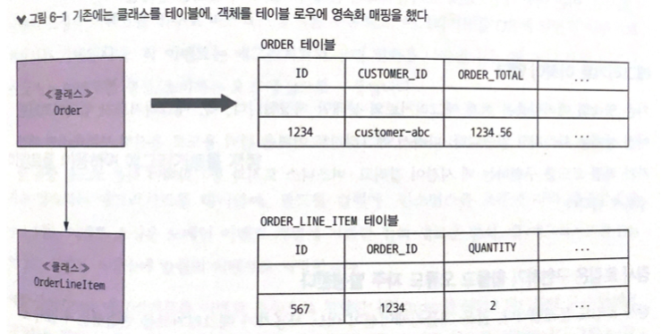
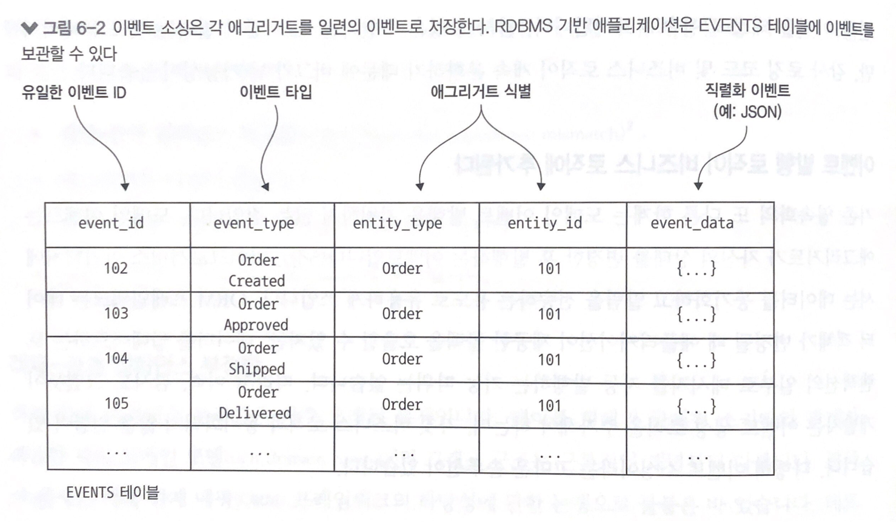
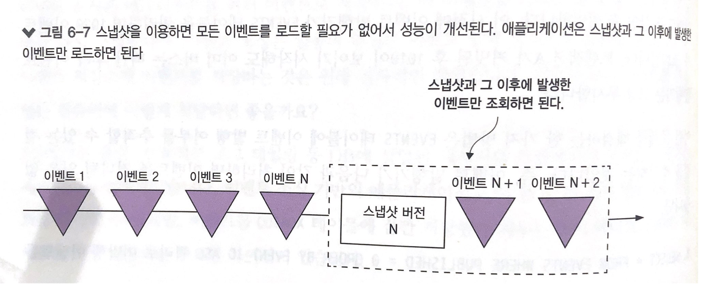
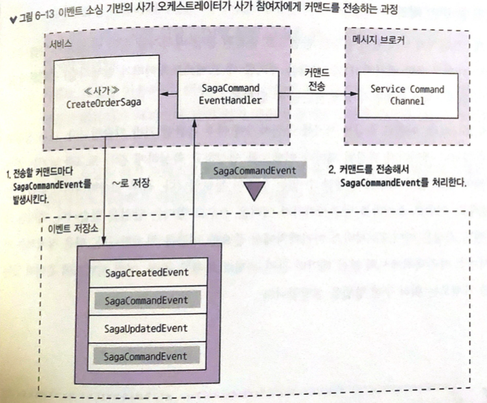

# 6장 비즈니스 로직 개발: 이벤트 소싱

> 6장을 요약한 내용입니다
>

- 혹시라도 이벤트 발행 로직이 오류를 양산하는 공장이 되지는 않을까 걱정이다
- 애그리거트의 상태를 시작/변경하는 각 애그리거트의 메서드가 이벤트 목록을 반환하면 도메인 서비스는 이 이벤트를 발행한다
- 다른 한편으로는 이벤트 발행 로직이 비즈니스 로직에 추가되기 때문에 개발자가 실수로 이벤트 발행 로직을 빠뜨려도 비즈니스 로직은 그냥 흘러갈 것이다
- 이벤트를 발행하는 것이 버그의 원천이 되지는 않을지 염려가 된다
- 예전에는 모든 변경 이력을 애그리거트에 고스란히 보존하는 이벤트 소싱에 여러모로 매력을 느꼈지만 뚜렷한 확신은 없었다
- 이벤트 소싱을 잘 활용하면 애그리거트가 생성/수정될 때마다 무조건 이벤트를 발행해서 프로그래밍 오류를 제거할 수 있다
- 이 장은 이벤트 소싱의 작동 원리를 살펴보고, 이벤트 소싱을 이용하여 비즈니스 로직을 작성하는 방법을 살펴보자

# 이벤트 소싱 응용 비즈니스 로직 개발

- 이벤트 소싱은 비즈니스 로직을 구성하고 애그리거트를 저장하는 또 다른 방법이다

## 이벤트 소싱은 여러모로 좋은 점이 많다

- 애그리거트 이력이 보존되므로 감사/통계 용도로도 가치가 있다
- 도메인 이벤트를 확실하게 발행할 수 있어서 MSA에 유용하다

## 물론 단점도 있다

- 비즈니스 로직을 작성하는 방법이 특이해서 어느 정도 학습 시간이 필요하다
- 이벤트 저장소를 쿼리하기가 쉽지 않아 CQRS 패턴을 적용해야 한다

# 기존 영속화의 문제점

- 클래스는 DB 테이블에, 클래스 필드는 테이블 컬럼에, 클래스 인스턴스는 테이블 각 로우에 매핑 하는 것이 기존 영속화 방식이다



## 이는 작동은 잘 되지만, 다음과 같은 단점 및 한계가 있다

- 객체-관계 임피던스 부정합
- 애그리거트 이력이 없다
- 감사 로깅을 구현하기가 번거롭고 에러가 잘 난다
- 이벤트 발행 로직이 비즈니스 로직에 추가된다

# 이벤트 소싱 개요

- 이벤트 소싱은 이벤트를 위주로 비즈니스 로직을 구현하고, 애그리거트를 DB에 일련의 이벤트로 저장하는 기법이다
- 각 이벤트는 애그리거트의 상태 변화를 나타낸다

## 이벤트를 이용하여 애그리거트를 저장

- 이벤트 소싱은 애그리거트를 DB에 있는 이벤트 저장소에 일련의 이벤트로 저장한다



- 애그리거트를 로드할 때 이벤트 저장소에서 이벤트를 가져와 재연을 하는데, 구체적으로 이 작업은 다음 3단계로 구성된다
    1. 애그리거트의 이벤트를 로드한다
    2. 기본 생성자를 호출하여 애그리거트 인스턴스를 생성한다
    3. 이벤트를 하나씩 순회하며 apply()를 호출한다


## 애그리거트 메서드의 관심사는 오직 이벤트

- 이벤트를 발생시켜 적용하려면 비즈니스 로직을 다시 구성해야 한다
- 이벤추에이트 클라이언트라는 이벤트 소싱 프레임워크에서는 이런 메서드를 process()와 apply()라고 명명한다
- process()는 업데이트 요청 값이 담긴 커맨드 객체를 매개변수로 받아 이벤트 목록을 반환하는 메서드이다
- apply()는 이벤트를 매개변수로 받아 void를 반환하는 메서드이다
- 애그리거트는 각 커맨드 클래스마다 하나의 process()와 애그리거트가 발생시킨 이벤트 타입마다 하나의 apply()를 여러 가지 버전으로 오버로드하여 정의한다

## 이벤트 소싱 기반의 Order 애그리거트

- createOrder(), revise()처럼 JPA 기반의 애그리거트를 생성/수정하는 메서드가 이벤트 소싱 기반 코드에서는 모두 process(), apply()로 대체된다
- 팩토리 메서드 createOrder()는 process(), apply()로 바뀌었다
- process()는 CreateOrderCommand를 받아 OrderCreatedEvent를 발생시키고, apply()는 OrderCreatedEvent를 받아 Order의 각 필드를 초기화한다

```jsx
public class Order {
	...
	public List<Event> process(CreateOrderCommand command) { // 커맨드 검증 후 OrderCreatedEvent 반환
		// 커맨드 검증
		return events(new OrderCreatedEvent(command.getOrderDetails()));
	}

	public void apply(OrderCreatedEvent event) { // Order 필드를 초기화해서 OrderCreatedEvent 적용
		OrderDetails orderDetails = event.getOrderDetails();
		...
	}

	public List<Event> process(ReviseOrder command) {
		// 변경 가능한 Order인지, 변경 주문 수량이 최소 주문량 이상인지 확인
		OrderRevision orderRevision = command.getOrderRevision();

		...
		switch (state) {
			...
		}
		return singletonList(new OrderRevisionProposed(...));
	}

	public void apply(OrderRevisionProposed event) { // Order를 REVISION_PENDING 상태로 변경
		this.state = REVISION_PENDING;
	}

	public List<Event> process(ConfirmReviseOrder command) {
		// 확정 가능한 변경 건인지 확인 후 OrderRevised 이벤트 반환
		swicth (state) { ... }
		return singleonList(new OrderRevised(...));
	}

	public void apply(OrderRevised event) {
		// Order 변경
		OrderRevision orderRevision = event.getOrderRevision();
		...
		this.state = APPROVED;
	}

}
```

### 동시 업데이트: 낙관적 잠금

- 기존 영속화 메커니즘은 대개 한 트랜잭션이 다른 트랜잭션의 변경을 덮어 쓰지 못하게 낙관적 잠금을 하여 처리한다
- 즉, 애그리거트 루트를 VERSION 컬럼이 있는 테이블에 매핑하고 애그리거트가 업데이트될 때마다 UPDATE 문으로 값을 하나씩 증가한다
- 두 트랜잭션이 같은 애그리거트를 읽는다면 첫 번째 트랜잭션은 성공적으로 애그리거트를 업데이트하고, 두 번째 트랜잭션은 그 사이 버전 번호가 바뀌었으니 실패한다
- 이벤트 저장소 역시 낙관적 잠금 기법으로 동시 업데이트를 처리할 수 있다

# 이벤트 소싱과 이벤트 발행

- 저장된 모든 이벤트를 관심있는 컨슈머에 어떻게 전달하면 좋을까?

## 이벤트 발행: 폴링

- 이벤트를 EVENTS 테이블에 저장한다고 가정하면 어느 이벤트가 새 이벤트인지 분간하는게 문제이다
- 만약 EVENT_ID가 단순히 1만큼 증가하면, 이벤트 발행기가 자신이 처리한 마지막 EVENT_ID를 기록하면 된다
- 그러나 트랜잭션이 이벤트를 발생시키는 순서와 다르게 커밋할 수 있다는 점이 문제이다


- 이런 문제를 해결하는 한 가지 방법은 EVENTS 테이블에 이벤트 발행 여부를 추적할 수 있는 컬럼을 추가하는 것이다
- 이벤트 발행기가 다음과 같이 처리하면 이벤트를 건너뛸 일은 없을것이다
    1. SELECT * FROM EVENTS WHERE PUBLISHED = 0 쿼리로 미발행 이벤트를 검색한다
    2. 메시지 브로커에 이벤트를 발행한다
    3. UPDATE EVENTS SET PUBLISHED = 1 WHERE EVENT_ID = ? 쿼리로 이벤트가 발행된 것으로 표시한다


## 스냅샷으로 성능 개선

- Order 애그리거트는 상태 전이가 별로 없는 편이라 이벤트가 많지 않다
- 이런 이벤트는 이벤트 저장소를 쿼리해서 Order 애그리거트를 재구성하는 것이 효율적이다
- 하지만 Account 애그리거트처럼 수명이 긴 애그리거트는 이벤트 수가 꽤 많아서 일일이 로드/폴드하기가 만만찮다
- 그래서 주기적으로 애그리거트 상태의 스냅샷을 저장한다



- 스냅샷 버전이 N이면 N + 1 이후에 발생한 이벤트 2개만 가져오면 애그리거트 상태를 되살릴 수 있다

# 도메인 이벤트 발전시키기

- 이벤트 소싱은 적어도 개념적으로는 이벤트를 영구 저장하지만 사실 이것은 양날의 검과 같다
- 정확성을 담보로 변경 감사 로그를 제공하여 애플리케이션이 애그리거트 상태를 온전히 재구성 할 수 있다
- 반면 이벤트 구조는 시간이 흐름에 따라 계속 달라지기 때문에 새로운 문제가 생기게 마련이다
- 우선 이벤트가 어떤 경로를 거쳐 변경되는지 알아보고, 가장 흔히 사용하는 변경 처리 방법을 알아보자

## 이벤트 소싱의 장점

- 도메인 이벤트를 확실하게 발행한다
- 애그리거트 이력이 보존된다
- O/R 임피던스 불일치 문제를 대부분 방지할 수 있다
- 개발자에게 타임 머신을 제공한다

## 이벤트 소싱의 단점

- 새로운 프로그래밍 모델을 배우는 데 시간이 걸린다
- 메시징 기반 애플리케이션은 복잡하다
- 이벤트를 개량하기가 까다로운 편이다
- 데이터를 삭제하기가 어렵다
- 이벤트 저장소를 쿼리하기가 만만찮다

# 이벤추에이트 로컬 이벤트 저장소의 작동 원리


- 이벤추에이트 로컬은 오픈 소스 이벤트 저장소이다
- 애플리케이션은 애그리거트 이벤트를 기본키로 조회/삽입하고 아파치 카프카 등의 메시지 브로커에서 이벤트를 가져와 소비한다
- 이벤트 DB는 세 테이블로 구성된다
    - events : 이벤트를 저장
    - entities :  엔티티당 로우 하나
        - 엔터티별 현재 버전을 저장한다. 낙관적 잠금을 구현하는 용도로 쓰인다
        - 엔터티가 새성되면 이 테이블에 한 로우가 삽입되고, 엔터티가 업데이트될 때마다 entity_version 컬럼도 업데이트된다
    - snapshots : 스냅샷을 저장


### 이벤추에이트 로컬 이벤트 릴레이 이벤트를 DB에서 메시지 브로커로 전파

- 이벤트 릴레이는 이벤트 DB에 삽입된 이벤트를 이벤트 브로커로 전파
- MySQL 서버에 접속하여 binlog(MySQL DB의 업데이트 기록)를 읽는다
- EVENTS 테이블에 이벤트가 삽입되면 해당 아파치 카프카 토픽으로 발행된다

## 도메인 이벤트 구독

- 이벤추에이트 클라이언트 프레임워크는 이벤트 핸들러 작성에 필요한 API도 제공한다
- @EventSubscriber로 이벤트를 처리할 스프링빈을 지정한다

```jsx
@EventSubscriber(id="orderServiceEventHandlers")
public class OrderServiceEventHandlers {

	@EventHandlerMethod
	public void creditReserved(EventHandlerContext<CreditReserved> ctx) {
		CreditReserved event = ctx.getEvent();
		...
	}
}
```

# 코레오그래피 사가 구현: 이벤트 소싱

- 이벤트 소싱과 코레오그래피 사가는 찰떡궁합이나
- 물론 코레오그래피 사가는 단순해서 좋지만 단점도 많다
- 사가 코레오그래피에 이벤트를 사용하면 이벤트의 목적이 이원화된다
- 이벤트 소싱은 상태 변화를 나타내기 위해 이벤트를 이용하는데, 이벤트를 사가 코레오그래피에 갖다 쓰면 애그리거트에 갖다 쓰면 애그리거트는 상태 변화가 없어도 무조건 이벤트를 발생시켜야 한다
- 가령 애그리거트를 업데이트하면 비즈니스 규칙에 위배될 경우, 애그리거트는 반드시 이벤트를 발생시켜 오류를 보고해야 한다
- 더 큰 문제는 사가 참여자가 애그리거트를 생성할 수 없는 경우이다
- 이런 문제가 있어서 조금 더 복잡하지만 오케스트레이션 사가를 구현하는 것이 최선이다

## 오케스트레이션 사가 생성

- 사가 오케스트레이터는 일부 서비스 메서드에 의해 생성된다
- OrderService.createOrder() 같은 다른 서비스 메서드는 애그리거트를 생성/수정하고 사가 오케스트레이터를 생성하는 두 가지 일을 한다
- 서비스는 이 두가지 액션을 첫 번째 액션이 수행되면 두 번째 액션은 최종적으로 실행되는 방식으로 수행한다
- 두 액션이 서비스에서 반드시 수행되도록 보장하는 방법은 이벤트 저장소의 종류마다 다르다

## 이벤트 소싱 기반의 사가 참여자 구현


- 이벤추에이트 로컬처럼 RDBMS 이벤트 저장소를 이용한 서비스라면 별로 어렵지 않게 사가 커맨드 메시지를 원자적으로 처리하고 응답을 보낼 수 있다
- 하지만 이벤추에이트 트램 프레임워크와 동일한 트랜잭션으로 묶을 수 없는 이벤트 저장소를 이용하는 서비스는 전혀 다른 방법을 구사해야 한다
- 다음 두 가지 이슈를 해결해야 한다
    - 커맨드 메시지를 멱등하게 처리
    - 응답 메시지를 원자적으로 전송

### 예제: 이벤트 소싱 기반의 사가 참여자

- 주문 생성 사가의 참여자 중 하나의 회계 서비스를 보자
- 사가가 전송한 인증 커맨드를 이벤추에이트 사가 프레임워크로 구현한 회계 서비스에서 처리하는 과정이다
- 이벤트 순서는 다음과 같다
    1. 주문 생성 사가가 계좌 인증 커맨드를 메시징 채널을 통해 회계 서비스로 보낸다
    2. AccountingServiceCommandHandler는 주어진 Accounting 애그리거트로 커맨드를 전송한다
    3. 애그리거트가 AccountAuthorizedEvent와 SagaReplyRequestedEvent 두 이벤트를 발생시킨다
    4. SagaReplyRequestedEvent 이벤트 핸들러는 주문 생성 사가에 응답 메시지를 전송하여 SagaReplyRequestedEvent를 처리한다

# 사가 오케스트레이터 구현: 이벤트 소싱

- 다음은 사가 오케스트레이터를 구현하기 전에 고민해야 할 세 가지 설계 이슈이다
    1. 사가 오케스트레이터를 어떻게 저장할 것인가?
    2. 어떻게 오케스트레이터 상태를 원자적으로 변경하고 커맨드 메시지를 전송할 것인가?
    3. 어떻게 사가 오케스트레이터가 정확히 한 번만 메시지를 응답하게 만들 것인가?
- 4장에서는 RDBMS 기반의 사가 오케스트레이터를 배웠고, 이번에도 같은 방법으로 해결할 수 있다

## 커맨드 메시지를 확실하게 전송

- 다음은 어떻게 사가 상태를 원자적으로 업데이트하고 커맨드를 전송하는가 하는 문제이다
- 이벤추에이트 트램 기반의 사가는 오케스트레이터를 업데이트하고 커맨드 메시지를 메시지 테이블에 삽입하는 작업을 한 트랜잭션으로 묶어 수행했다
- 그 비결은 바로 전송할 커맨드를 나타낸 SagaCommandEvent를 저장하는 것이다



- 사가 오케스트레이터는 다음 두 단계로 커맨드를 전송한다
    1. 사가 오케스트레이터가 전송하려는 각 커맨드마다 SagaCommandEvent를 발생시킨다. SagaCommandEvent에는 목적지 채널, 커맨드 객체 등 커맨드 전송에 필요한 데이터가 모두 담겨 있다. 이런 이벤트는 이벤트 저장소에 저장된다
    2. 이벤트 핸들러는 SagaCommandEvent 처리 후 커맨드 메시지를 목적지 메시지 채널로 보낸다
- 동일한 이벤트를 받아 여러 번 이벤트 핸들러가 호출될 수 있는 구조이기 때문에 SagaCommandEvent 핸들러가 중복된 커맨드 메시지를 전송할 수도 있다

# 마치며

- 이벤트 소싱은 애그리거트를 일련의 이벤트로 저장하며, 여기서 각 이벤트는 애그리거트의 생성 또는 상태 변화를 나타낸다. 이벤트를 재생하면 특정 애그리거트 상태를 그대로 재생성할 수 있다. 이벤트 소싱 덕분에 도메인 객체의 이력 및 감사 로그를 정확히 남기고 도메인 이벤트를 확실하게 발행할 수 있다
- 스냅샷은 재연해야 할 이벤트 개수를 줄여 성능을 향상시킨다
- 이벤트는 DB와 메시지 브로커를 혼합한 형태인 이벤트 저장소에 저장된다. 서비스가 이벤트를 이벤트 저장소에 저장하면 이벤트 저장소는 이벤트를 구독기에 전달한다
- 이벤추에이트 로컬은 필자가 MySQL 및 아파치 카프카 기반으로 개발한 오픈 소스 이벤트 저장소이다. 개발자는 이벤추에이트 클라이언트 프레임워크를 이용하여 애그리거트 및 이벤트 핸들러를 작성할 수 있다
- 애플리케이션에서 이벤트 재연 시 여러 버전의 이벤트를 처리해야 할 수도 있기 때문에 이벤트 발전을 다루는 일이 관건이다. 따라서 이벤트 저장소에서 이벤트를 가져올 때 최근 버전으로 이벤트를 업그레이드하는 업캐스팅이 좋은 방법이다
- 이벤트 소싱 애플리케이션은 데이터를 삭제하기가 까다롭다. 개인 정보를 삭제하는 애플리케이션에서 유럽 연합 GDPR 등의 규정을 준수하려면 암호화/가명화 등의 기법을 동원해야 한다
- 이벤트 소싱을 이용하면, 이벤트 소싱 기반의 애그리거트가 발행한 이벤트를 리스닝하는 이벤트 핸들러가 서비스에 달려 있기 때문에 코레오그래피 사가를 간단히 구현할 수 있다
- 이벤트 소싱은 사가 오케스트레이터를 구현하기 좋은 수단이다. 덕분에 이벤트 저장소를 배타적으로 사용하는 애플리케이션을 작성할 수 있다

# 참고

- [https://github.com/tongnamuu/SpringEvent](https://github.com/tongnamuu/SpringEvent)
- [https://frost-witch-afb.notion.site/YOUTHCON-21-365e94c3df3443e5b1322520a8b1a2ef?p=e23a6710a5344ebc973bc29c5a8a1193&pm=s](https://www.notion.so/e23a6710a5344ebc973bc29c5a8a1193)
- [https://frost-witch-afb.notion.site/YOUTHCON-22-a18e4511463a416e8befd99993355215](https://www.notion.so/YOUTHCON-22-a18e4511463a416e8befd99993355215)
