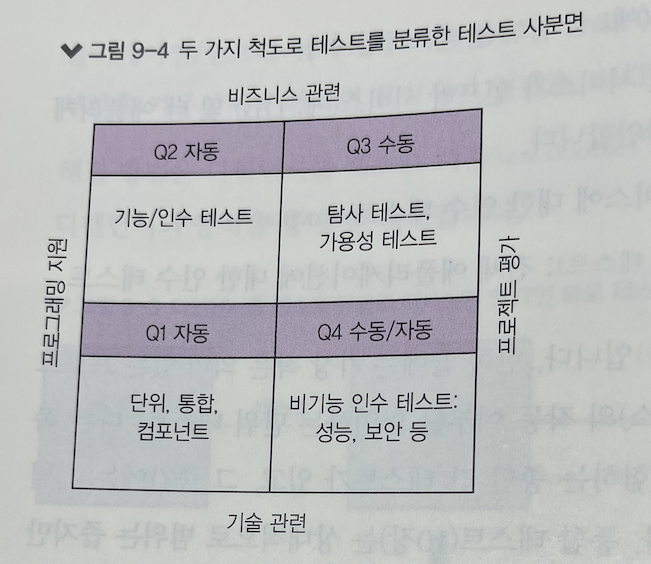
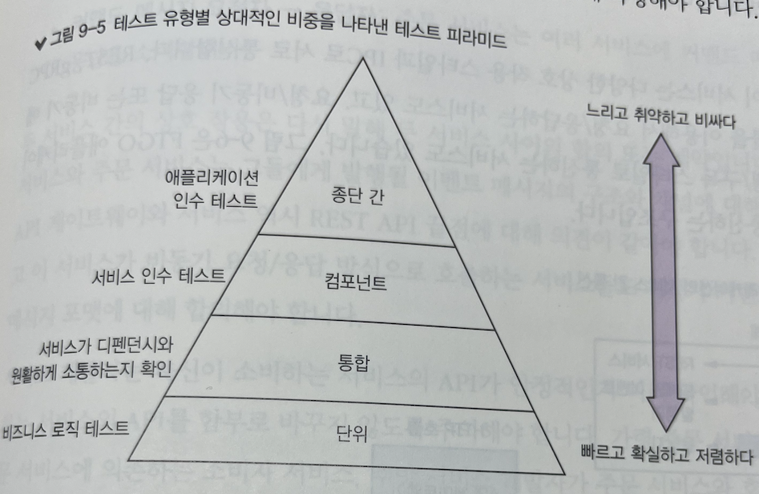
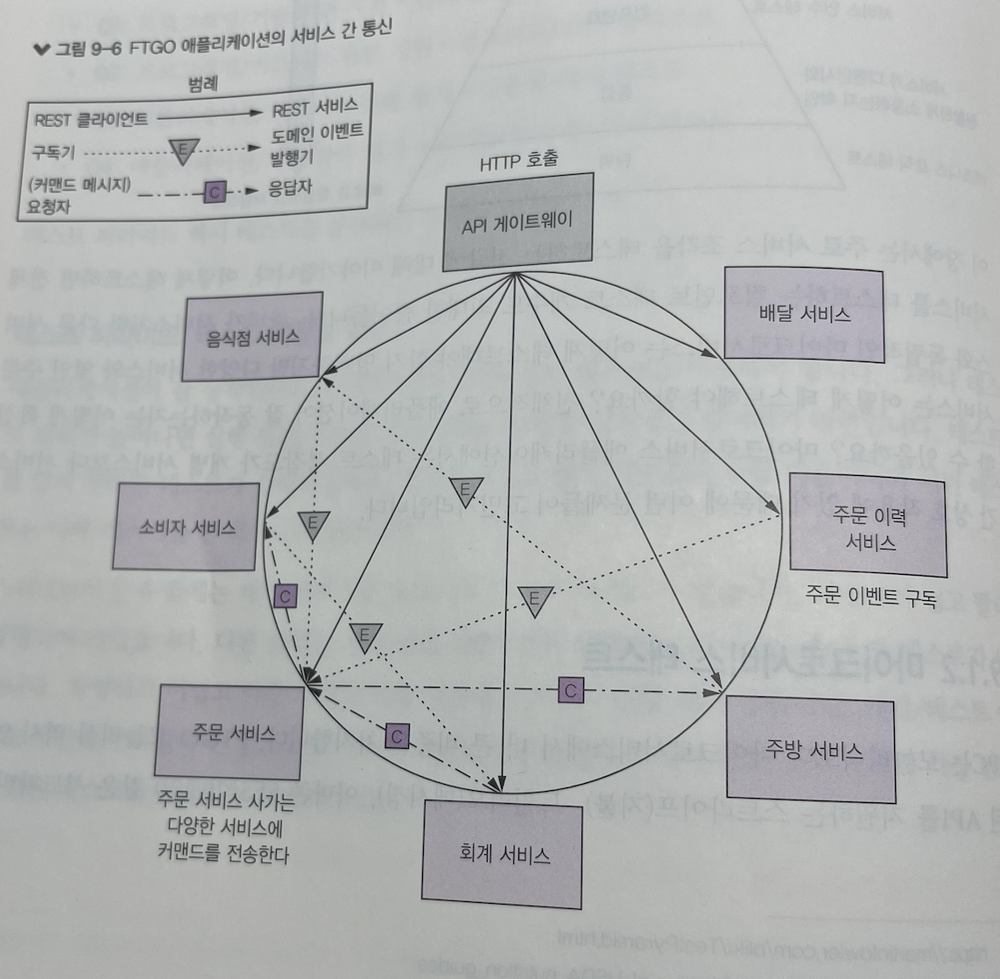
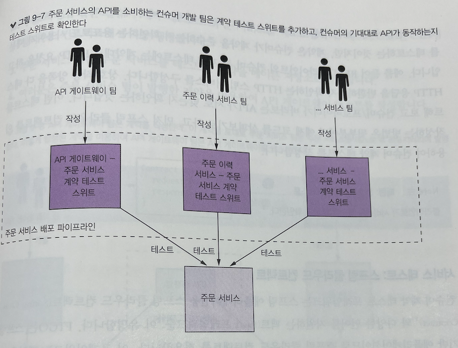
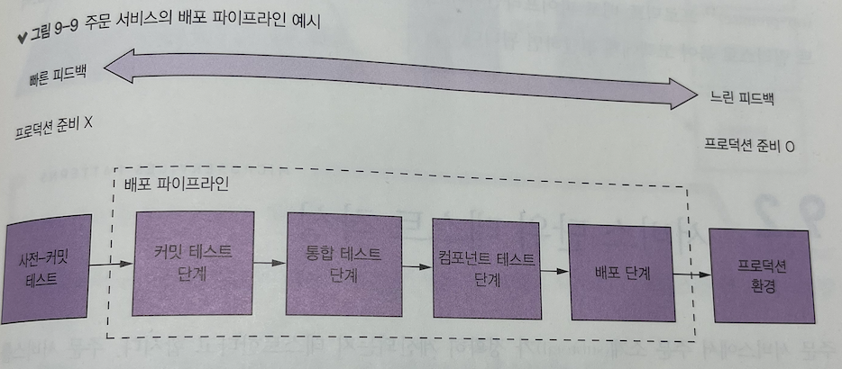

# 마이크로서비스 테스트 1부

## 옛날 테스트 방식의 한계

1. 수동 테스트는 비효율적이다.
2. 테스트가 늦다.

### 현황

2018년 기준(소스 랩 테스팅 트렌드) 테스트자동화 비율은 대체로 자동화 26%, 완전 자동화 3%이다.

### 테스트 진입장벽 원인

* 문화적 요인: "테스트는 OA가 하는일이야, 개발자는 개발할 시간도 부족해"
* 기술적 어려움: 테스트 케이스 구현 난이도가 높은 경우

### 마이크로서비스 특징

* 복잡한 테스트를 단순하게 개선시키는 점
* 복잡한 구조의 서비스들간 상호작용을 확인하기 위해 테스트는 필수적

> 자동화 테스트를 작성하지 않는 것은 모놀리식 지옥으로 가는 지름길.

## 마이크로서비스 아키텍쳐 테스트 전략

> 테스트 케이스는 어떤 목표를 달성(예: 프로그램이 특정 경로를 실행하는지, 지정된 요건에 부합하는지 등을 확인)하기 위해 개발된 테스트 입력, 실행 조건, 기대 결과의 집합이다.

**SUT(System Under Test)**: 작게는 클래스, 크게는 전체 애플리케이션 대상 시스템

### 자동화 테스트 작성

1. 설정: 테스트에 필요한 픽스처(test fixture) 초기화
2. 실행: SUT 호출
3. 확인: 호출 결과 및 대상 상태 검증
4. 정리: 설정단계에서 초기화 정리

### 목/스텁을 이용한 테스트

* 스텁: SUT에 값을 반환하는 객체
* 목: SUT가 정확하게 디펜던시를 호출했는지 확인하는 객체

> 목은 스텁의 일종이다.

### 테스트 종류

* 단위 테스트: 서비스의 작은 부분(클래스) 테스트
* 통합 테스트: 서비스 인프라, 타 앱과 잘 연동되는지 테스트
* 컴포넌트 테스트: 인수 테스트
* 종단 간 테스트: 전체 애플리케이션 인수 테스트

### 테스트 사분면

* 비지니스, 기술 어느 분야에 관한 테스트인가?
  * 비지니스는 도메인 용어를, 기술 분야는 개발, 구현  용어를 써서 기술합니다.
* 테스트 목적
  * 프로그래밍 지원 테스트: 운영 서비스 관리
  * 애플리케이션 평가 테스트: 개선이 필요한 부분 식별



### 테스트 피라미드

**신뢰할 수 있는 테스트를 유지하는게 중요하다.** 신뢰하지 않는 테스트 케이스는 실패가 나더라도 무시하게 된다.

리소스 배분을 효율적으로 하기 위해서, 테스트 피라미드의 핵심은 상부로 갈수록 작성하는 테스트 갯수가 줄어듭니다. 

단위 테스트는 많이, 종단 간 테스트는 적게 작성해야 합니다.



## 마이크로 서비스 테스트

모놀리식 서비스 역시 스트라이프(지불), 트윌리오(메시징)과 같은 서드파트 앱의 서비스를 호출하지만, **중추**는 아닙니다.

하지만 마이크로서비스 패턴에서는 IPC가 중추가 됩니다. 서비스를 담당하는 팀은 각각 API를 발전시키는 분산 시스템이며,

클라이언트와 잘 연동이 될 수 있도록 테스트를 작성해서 확인해야 합니다.

3장에서 설명했듯이, 서비스간 상호작용은 다양합니다.

* REST, gRPC 동기 프로토콜: REST API
  * 클라이언트 최초 요청
* 요청/비동기 응답: 커맨드 메시지
  * 사가를 통해서 커맨드 진행
* 발행/구독 형태의 비동기 메세징: 도메인 이벤트
  * OrderEvent 구독 중: OrderHistoryEventHandlers
  * OrderEvent 발행: OrderService



상호작용하는 두 서비스는 기존 인터페이스에 호환되도록, 서비스를 개선해야하고 만약 그렇지 못하다면, 사전에 미리 의존하고 있는

서비스 담당자에게 변경사항을 알려야 한다. 서비스간 상호작용을 테스트하기 위해서는 **종단 간 테스트**를 통해 확인할 수 있지만,

비용이 비싸기 때문에, 더 가벼운 방식인 `컨슈머 주도 계약 테스트`를 활용을 고려할 수 있습니다.

### 컨슈머 주도 계약 테스트

컨슈머 계약 테스트의 초점은 API의 `형상`이 컨슈머의 기대와 부응하는지 확인하는 것입니다.

* REST방식을 예
  * HTTP 메소드, 경로
  * 헤더 값 검증
  * 본문 값 검증
  * 상태 코드 검증

컨슈머 주도 계약 `테스트는 비지니스 로직을 검증하는 테스트`가 아니라 `컨슈머에서 기대하고 있는 값을 검증하는 테스트`입니다.

각 컨슈머를 담당하는 팀에서 테스트 케이스를 작성해, 프로바이더쪽에 PR요청으로 형상관리를 진행합니다.

컨슈머 주도 계약 테스트는 케이스에 의한 테스트를 진행합니다. (샘플 요청에 대한 샘플 응답을 충족하는지 검증)



### 스프링 클라우드 컨트랙트

* 컨슈머 계약 테스트 프레임워크
  * 스프링 클라우드 컨트랙트
  * 팩트(Pact)

계약을 루비 DSL로 작성이 가능하고, 각 계약은 컨슈머/프로바이더 간 구체적인 샘플로 구성됩니다.

프로바이더의 계약 테스트 코드를 생성하고, 컨슈머 통합 테스트용 목서버를 구성합니다.

#### (API GW -> 주문서비스) 테스트 절차

1. 샘플요청,응답을 기준으로 주문서비스 계약을 작성한다.
2. 작성된 계약으로 주문서비스를 테스트한다.
3. 테스트한 계약을 메이븐 저장소로 발행한다.
4. 발행된 계약을 이용해 API-GW 테스트를 작성한다.

```ruby
org.springframework.cloud.contract.spec.Contract.make {
  # API-GW 요청
  request {
    method 'GET'
    url '/orders/123'
  }
  # API-GW 요청에 대한 기대 응답
  response {
    status 200
    headers {
      header('content-type': 'application/json;charset=UTF-8')
    }
    body("{..}")
  }
}
```

### 컨슈머 계약 테스트: 메시징 API

REST API뿐만 아니라, 도메인 이벤트를 구독, 비동기 요청/응답 통신을 하는 서비스 역시 컨슈머 계약 테스트를 작성해야 합니다.

스프링 클라우드 컨트랙트를 이용하면 메시징 기반도 테스트가 가능합니다. 

* 도메인 이벤트 테스트
  * 계약은 샘플 도메인 이벤트로 구성
  * 프로바이더: 이벤트를 발생시키고, 샘플 이벤트와 일치하는지 검증
  * 컨슈머: 샘플 이벤트를 처리할 수 있는지 검증
* 비동기 요청/응답 테스트
  * 계약은 요청/응답 메시지로 구성
  * 프로바이더: 샘플 요청 API 응답과 샘플 응답 검증
  * 컨슈머: 스텁 구독기를 이용해 검증

## 배포 파이프라인



파이프라인이 흘러갈수록 테스트는 점점 더 프로덕션과 유사하면서 엄격해지는 동시에, 실행 시간도 증가한다.

가능한 빨리 테스트 실패 피드백을 받기 위해서, 파이프라인 순서를 가벼운 테스트부터 통합 테스트까지 구성합니다.

* 사전-커밋 테스트: 단위 테스트(커밋 전)
* 커밋 테스트: 서비스 컴파일 후 단위 테스트, 정적 코드 분석 수행
* 통합 테스트
* 컴포넌트 테스트
* 배포

## 서비스 단위 테스트 작성

* 단위 테스트
  * 독립 테스트: 테스트 더블을 이용한 테스트
    * OrderService처럼 엔티티, 밸류객체 어디에도 속하지 않는 비지니스 로직 클래스 (도메인 서비스)
    * http 요청을 처리하는 컨트롤러
    * 인바운드/아웃바운드 메시징 게이트웨이
  * 공동 테스트: 타 클래스도 함께 테스트
    * order처럼 영속적으로 식별 가능한 엔티티
    * 밸류 객체
    * CreateOrderSaga처럼 여러 서비스에 걸쳐 데이터 일관성을 유지하는 사가

### 단위 테스트: 엔티티

https://github.com/microservices-patterns/ftgo-application/blob/master/ftgo-order-service/src/test/java/net/chrisrichardson/ftgo/orderservice/domain/OrderTest.java

### 단위 테스트: 밸류 객체

https://github.com/microservices-patterns/ftgo-application/blob/master/ftgo-common/src/test/java/net/chrisrichardson/ftgo/common/MoneyTest.java

### 단위 테스트: 사가

https://github.com/microservices-patterns/ftgo-application/blob/master/ftgo-order-service/src/test/java/net/chrisrichardson/ftgo/orderservice/sagas/createorder/CreateOrderSagaTest.java

### 단위 테스트: 도메인 서비스

https://github.com/microservices-patterns/ftgo-application/blob/master/ftgo-order-service/src/test/java/net/chrisrichardson/ftgo/orderservice/domain/OrderServiceTest.java

### 단위 테스트: 컨트롤러

https://github.com/microservices-patterns/ftgo-application/blob/master/ftgo-order-service/src/test/java/net/chrisrichardson/ftgo/orderservice/web/OrderControllerTest.java

### 단위 테스트: 이벤트/메시지 핸들러

https://github.com/microservices-patterns/ftgo-application/blob/master/ftgo-order-service/src/test/java/net/chrisrichardson/ftgo/orderservice/messaging/OrderEventConsumerTest.java

그러나 단위 테스트로는 상호작용이 잘 동작하고 있는지 확인하는데는 한계가 있다.

그렇기 때문에, 각 서비스와 상호작용을 확인하는 `통합테스트`, 각 서비스가 잘 동작하는지 확인하는 `컴포넌트 테스트`도 함께 병행되어야 합니다.

## 요약

* 자동화 테스트는 서비스를 신속,안전하게 전달하는 주요 근간이다.
* 테스트 목적은 시스템의 동작을 확인하는 것이다. (클래스 ~ 전체 서비스)
* 테스트 더블을 이용해, 테스트의 복잡성을 줄일 수 있다.
  * 스텁: 원하는 값을 반환하는 용도
  * 목: 정확하게 디펜던시를 호출하는지 확인하는 용도
* 일반적으로 실행이 빠르고 결과가 확실한 단위테스트를 중점으로 작성하고, 종단 간 테스트는 복잡하므로 가급적 개수를 줄여야 한다.